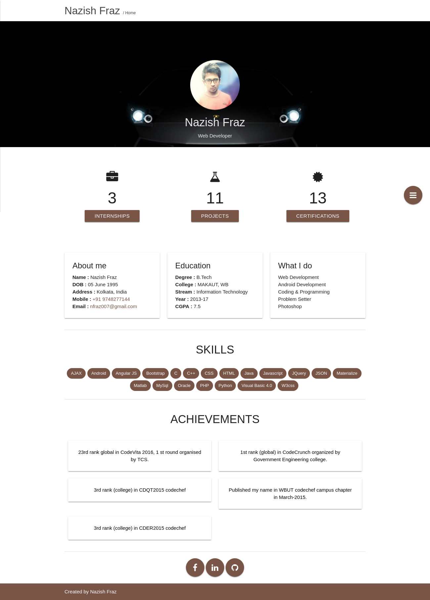

# Portfolio v2
A dynamic resume website, which show data from database. 

Full Documentation [https://nfraz007.github.io/portfolio_v3/](https://nfraz007.github.io/portfolio_v3/)

# Technologies: 
* front-end : HTML, CSS, JavaScript, Jquery, Materialize 
* back-end : PHP, Mysqli, JSON
* Software : Xampp (or any local server), Any browser

# Setup and Installation
* Download the zip file of this directory.
* Copy the file into your xampp htdocs location. by default the location is **C://xampp/htdocs**
* Open the xampp controller and start Apache and Mysql
* Open any browser any type **localhost/phpmyadmin** in the URL
* Create a new database **portfolio_v2** or whatever you want
* Select this database and click on **import** section. select this file : **C://xampp/htdocs/portfolio_v2/sql/portfolio_v2.sql**, and hit OK. It will create all the relevant table for this project.
* create a new file in project directory, name as my_config.php
* copy then content from my_config.sample and paste in newly created my_config.php file
* fill the configration according to your requirement.
* Now everything is set. Open your browser any type this : **localhost/portfolio_v2**

# Snapshot

* Home page

